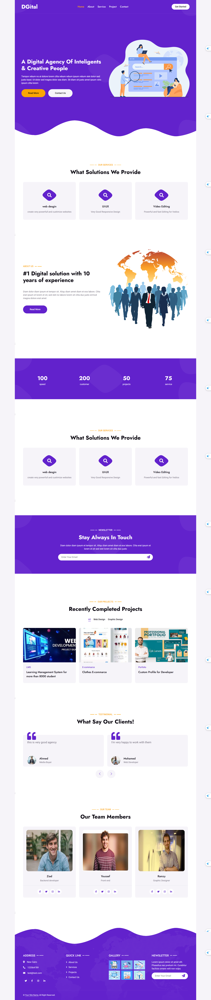

# 🌐 Digital Agency

This is my first project built with **Laravel** and **Livewire** as a practice project.  
It represents a digital agency/company profile with an **Admin Dashboard** to manage content and a **Frontend** built with Blade templates.



## 📌 Features
- **Authentication**: Admin login to manage the dashboard  
- **Categories**: Manage company categories  
- **Projects**: Showcase projects in different categories  
- **Services**: List and manage offered services  
- **Testimonials**: Display client feedback  
- **Members**: Manage company team members  
- **Subscriptions**: Collect emails to send offers and news  
- **Contact Us**: Handle customer messages  
- **Search**: Search through projects/services  

All modules are fully manageable from the **Admin Dashboard** and integrated into the **frontend**.

## 🛠️ Tech Stack
- **Laravel 10**  
- **Livewire** (for dynamic components in the dashboard)  
- **Blade** (for frontend)  
- **MySQL**  
- **TailwindCSS / Bootstrap**

🚀 Usage

Visit / to see the Frontend Website

Visit /admin to access the Dashboard Login Page

🔑 Demo Admin Access

To log in to the dashboard, use the following credentials:

Email: ziad@admin.com

Password: 123456

📧 Contact Me

If you’d like to reach me:

- **Email**: [ziadbadr5947@gmail.com](mailto:ziadbadr5947@gmail.com)  
- **LinkedIn**: [Ziad Mahmoud Badr](https://www.linkedin.com/in/ziad-mahmoud-badr-8452ba1ba/)  


## ⚙️ Installation
```bash
# Clone the repository
git clone https://github.com/ziadmahmoud/digital-agency.git

# Navigate to the project folder
cd digital-agency

# Install dependencies
composer install
npm install && npm run dev

# Create .env file and configure your database
cp .env.example .env

# Generate app key
php artisan key:generate

# Run migrations
php artisan migrate --seed

# Start the development server
php artisan serve

# Start the development server
php artisan s
